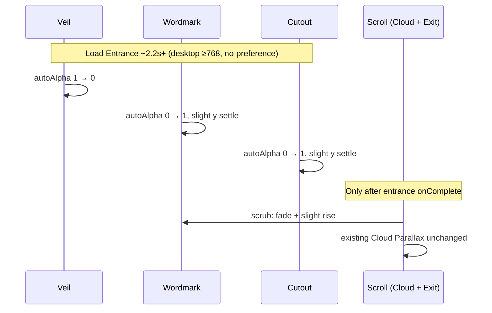

# Hero GSAP Animation Implementation Plan

> **For agentic workers:** REQUIRED SUB-SKILL: Use superpowers:subagent-driven-development (recommended) or superpowers:executing-plans to implement this plan task-by-task. Steps use checkbox (`- [ ]`) syntax for tracking.

**Goal:** Add a ceremonial Load Entrance (dark→light Veil → Wordmark → Cutout) and a Wordmark Scroll Exit on the landing hero, without changing Cloud Parallax.

**Architecture:** Keep Cloud Parallax in `useScrollParallax`. Add a dedicated hero motion hook (entrance timeline + exit ScrollTrigger) gated by `gsap.matchMedia()` for `min-width: 768px` and `prefers-reduced-motion: no-preference`. Create/enable scroll-driven hero motion only after Load Entrance `onComplete` (ADR-0001). Remove the CSS `wordmarkIn` animation so GSAP owns Wordmark motion.

**Tech Stack:** GSAP 3 core + ScrollTrigger, React 19 client Hero, CSS Modules, existing design tokens.

**Glossary:** [CONTEXT.md](../../../CONTEXT.md) (Hero motion terms)  
**ADR:** [docs/adr/0001-finish-load-entrance-before-scroll.md](../../adr/0001-finish-load-entrance-before-scroll.md)  
**Spec baseline:** [docs/superpowers/specs/2026-07-11-hero-redesign-design.md](../specs/2026-07-11-hero-redesign-design.md) (clouds still locked untouched)

---

## Locked motion design



| Beat | Targets | Motion | Notes |
|---|---|---|---|
| Dark-to-Light | Veil | `autoAlpha` 1 → 0 | Full-bleed; `pointer-events: none` |
| Brand | Wordmark | `autoAlpha` 0 → 1, `y` ~12–20 → 0 | Prefer `autoAlpha` over `opacity` |
| Figure | Cutout (`.heroBg`) | `autoAlpha` 0 → 1, slight `y` settle | Entrance only |
| Scroll Exit | Wordmark | scrubbed `autoAlpha` → 0, `y` ≈ −24–40 | Same hero trigger range as clouds |
| Cloud Parallax | layers / wisps / mist | existing scrub | Do not modify configs |

**Gates**

- Motion ships: `(min-width: 768px) and (prefers-reduced-motion: no-preference)`
- ≤767px or `prefers-reduced-motion: reduce`: final poster only (no Veil, no entrance/exit). Clouds already off ≤767.

**Interrupt (ADR-0001)**

- Entrance timeline always finishes if started.
- Do **not** create/enable Cloud Parallax + Scroll Exit ScrollTriggers until entrance `onComplete` (or skip straight to enabling them when motion is gated off).
- If the user scrolled during entrance, `ScrollTrigger.refresh()` after enable so scrub matches current scroll.

**Suggested timing (tunable)**

```text
Total ~2.2–2.5s
  veil:     duration 0.85, ease power2.inOut
  wordmark: duration 0.7,  ease power3.out, overlap "-=0.2"
  cutout:   duration 0.75, ease power3.out, overlap "-=0.25"
```

---

## File map

| File | Responsibility |
|---|---|
| `components/Hero/Hero.tsx` | Add Veil node; refs for veil / wordmark / cutout; call new hook; keep cloud wiring |
| `components/Hero/Hero.module.css` | Veil styles; remove `wordmarkIn` CSS animation |
| `components/hooks/useHeroMotion.ts` | **Create** — Load Entrance timeline + Wordmark Scroll Exit; matchMedia gates; handoff to cloud enable |
| `components/hooks/useScrollParallax.ts` | Accept `enabled` (or equivalent) so ScrollTriggers are not created until entrance completes; optional cleanup of unused `titleBlockRef` / `titlePoemRef` |
| `CONTEXT.md` / `docs/adr/0001-…` | Already written in grilling — do not regress |

---

### Task 1: Veil markup + CSS; remove CSS wordmark entrance

**Files:**
- Modify: `components/Hero/Hero.tsx`
- Modify: `components/Hero/Hero.module.css`

- [ ] **Step 1:** Add a Veil element inside `.hero` (above content layers, below nothing interactive):

```tsx
<div className={styles.veil} ref={veilRef} aria-hidden="true" />
```

Place it as the last child of the section (or with `z-index` high enough to cover sun / wordmark / cutout / clouds during the opening). Keep `pointer-events: none`.

- [ ] **Step 2:** Add CSS:

```css
.veil {
  position: absolute;
  inset: 0;
  z-index: 25; /* above paper fade (20) for true dark field, or 15 if fade should stay on top — prefer covering the poster stack; paper fade can sit under veil */
  background: #1a1510; /* near-ink, not pure black — tune visually */
  pointer-events: none;
}
```

Default the Veil to `opacity: 0` / `visibility: hidden` in CSS for no-JS / reduced-motion / mobile SSR safety; GSAP will `gsap.set` it visible only when the entrance media query matches.

- [ ] **Step 3:** Remove `@keyframes wordmarkIn` and the `@media (prefers-reduced-motion: no-preference) { .wordmark { animation: … } }` block so GSAP owns Wordmark entrance.

- [ ] **Step 4:** Confirm ≤767 and reduced-motion still show Wordmark + Cutout at full opacity with no Veil visible (CSS defaults).

---

### Task 2: Gate Cloud Parallax until entrance completes

**Files:**
- Modify: `components/hooks/useScrollParallax.ts`

- [ ] **Step 1:** Add an `active` (or `enabled`) boolean argument, default `true` for backward safety:

```ts
export function useScrollParallax(
  configs: CloudLayerConfig[],
  wispBaseOpacities: number[],
  enableClouds = true,
  active = true,
) {
```

- [ ] **Step 2:** At the start of the `useEffect`, if `!active`, skip creating the scrub timeline / ScrollTriggers (still allow reduced-motion mist hide if desired). Depend on `active` in the effect deps.

- [ ] **Step 3:** Optionally remove dead `titleBlockRef` / `titlePoemRef` and the `titleTargets` scroll tweens — Wordmark Scroll Exit moves to `useHeroMotion`. If you keep the refs temporarily, do not leave half-wired title exit competing with the new exit.

- [ ] **Step 4:** From `Hero`, pass `active: entranceDone` (see Task 3).

---

### Task 3: `useHeroMotion` — Load Entrance + Scroll Exit

**Files:**
- Create: `components/hooks/useHeroMotion.ts`
- Modify: `components/Hero/Hero.tsx`

- [ ] **Step 1:** Create the hook with this shape:

```ts
'use client'

import { useEffect, useState, type RefObject } from 'react'
import { gsap } from 'gsap'
import { ScrollTrigger } from 'gsap/ScrollTrigger'

const MOTION_QUERY =
  '(min-width: 768px) and (prefers-reduced-motion: no-preference)'

type UseHeroMotionArgs = {
  heroRef: RefObject<HTMLElement | null>
  veilRef: RefObject<HTMLElement | null>
  wordmarkRef: RefObject<HTMLElement | null>
  cutoutRef: RefObject<HTMLElement | null>
}

export function useHeroMotion({
  heroRef,
  veilRef,
  wordmarkRef,
  cutoutRef,
}: UseHeroMotionArgs) {
  const [scrollMotionActive, setScrollMotionActive] = useState(false)

  useEffect(() => {
    gsap.registerPlugin(ScrollTrigger)

    const hero = heroRef.current
    const veil = veilRef.current
    const wordmark = wordmarkRef.current
    const cutout = cutoutRef.current
    if (!hero || !veil || !wordmark || !cutout) return

    const media = gsap.matchMedia()

    media.add(MOTION_QUERY, () => {
      setScrollMotionActive(false)

      gsap.set(veil, { autoAlpha: 1 })
      gsap.set(wordmark, { autoAlpha: 0, y: 16 })
      gsap.set(cutout, { autoAlpha: 0, y: 28 })

      const entrance = gsap.timeline({
        defaults: { ease: 'power3.out' },
      })

      entrance
        .to(veil, { autoAlpha: 0, duration: 0.85, ease: 'power2.inOut' })
        .to(wordmark, { autoAlpha: 1, y: 0, duration: 0.7 }, '-=0.2')
        .to(cutout, { autoAlpha: 1, y: 0, duration: 0.75 }, '-=0.25')

      let exitTween: gsap.core.Tween | undefined

      const enableExit = () => {
        exitTween = gsap.to(wordmark, {
          autoAlpha: 0,
          y: -32,
          ease: 'none',
          scrollTrigger: {
            trigger: hero,
            start: 'top top',
            end: 'bottom top',
            scrub: 1,
            invalidateOnRefresh: true,
          },
        })
      }

      entrance.eventCallback('onComplete', () => {
        enableExit()
        setScrollMotionActive(true)
        ScrollTrigger.refresh()
      })

      return () => {
        entrance.kill()
        exitTween?.scrollTrigger?.kill()
        exitTween?.kill()
        gsap.set([veil, wordmark, cutout], { clearProps: 'opacity,visibility,transform' })
        setScrollMotionActive(false)
      }
    })

    // Non-matching viewports: ensure final poster, no veil
    media.add('(max-width: 767px), (prefers-reduced-motion: reduce)', () => {
      gsap.set(veil, { autoAlpha: 0 })
      gsap.set([wordmark, cutout], { autoAlpha: 1, y: 0 })
      setScrollMotionActive(true) // clouds may still be off via enableClouds
      return () => undefined
    })

    return () => media.revert()
  }, [heroRef, veilRef, wordmarkRef, cutoutRef])

  return { scrollMotionActive }
}
```

- [ ] **Step 2:** Wire refs in `Hero.tsx` and call:

```ts
const veilRef = useRef<HTMLDivElement>(null)
const wordmarkRef = useRef<HTMLHeadingElement>(null)
const cutoutRef = useRef<HTMLDivElement>(null)

const { scrollMotionActive } = useHeroMotion({
  heroRef, // share with useScrollParallax — either return heroRef from one hook or declare once in Hero
  veilRef,
  wordmarkRef,
  cutoutRef,
})

const { mistRef, setCloudRef, setWispRef } = useScrollParallax(
  CLOUD_LAYER_ANIMATIONS,
  WISP_BASE_OPACITIES,
  showClouds,
  scrollMotionActive && showClouds,
)
```

Ensure a **single** `heroRef` is shared by both hooks (declare in `Hero`, pass into both; or have `useScrollParallax` accept an external ref). Prefer declaring `heroRef` in `Hero` and changing `useScrollParallax` to take `heroRef` as an argument if needed to avoid two refs on one node.

- [ ] **Step 3:** Attach refs: `ref={wordmarkRef}` on `<h1>`, `ref={cutoutRef}` on `.heroBg`, `ref={veilRef}` on Veil.

---

### Task 4: Visual + a11y verification

**Files:** none (manual)

- [ ] **Step 1:** Desktop ≥768, no-preference: dark veil lifts → Wordmark → Cutout; total ~2.2s+; then scrolling fades/rises Wordmark while clouds parallax as before.

- [ ] **Step 2:** Scroll during entrance: entrance finishes; then scrub catches up (no stuck veil).

- [ ] **Step 3:** ≤767: no veil flash, no entrance/exit, no clouds; static poster.

- [ ] **Step 4:** `prefers-reduced-motion: reduce`: instant final poster; no transform/opacity animation.

- [ ] **Step 5:** Run `npm run lint` and `npm run build`.

- [ ] **Step 6:** Commit only if the user asks.

---

## Out of scope

- Changing `cloudLayerConfig` / cloud assets / wisp/mist behavior
- Mobile Load Entrance / Scroll Exit (deferred)
- Idle/looping hero motion
- Animating Nav during entrance
- Sun bloom as a separate beat (Veil-only Dark-to-Light)

---

## Self-review

1. **Spec coverage:** Entrance cast/order, veil mechanism, interrupt policy, exit motion, reduced motion, ≥768 gate, clouds untouched — all tasked.
2. **Placeholders:** None intentional; timings are starting values marked tunable.
3. **Consistency:** Terms match `CONTEXT.md`; interrupt matches ADR-0001.
