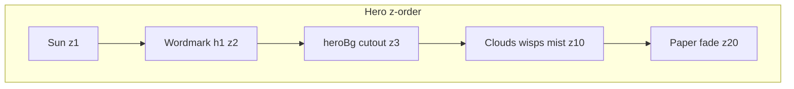

# Hero Redesign Implementation Plan

> **For agentic workers:** REQUIRED SUB-SKILL: Use superpowers:subagent-driven-development (recommended) or superpowers:executing-plans to implement this plan task-by-task. Steps use checkbox (`- [ ]`) syntax for tracking.

**Goal:** Ship a bold poster hero with the organization name stacked bilingual behind `hero_characters`, without changing the cloud parallax system.

**Architecture:** Content-driven wordmark (`nameZh` / `nameEn` from `hero` in home JSON) rendered in [components/Hero/Hero.tsx](components/Hero/Hero.tsx) between sun and `.heroBg`. CSS Modules handle type, z-index, responsive stacking, and a reduced-motion-safe load entrance. Cloud config, assets, and `useScrollParallax` stay untouched.

**Tech Stack:** Next.js 16 App Router, React 19, CSS Modules, existing design tokens in [app/globals.css](app/globals.css), content JSON + typed re-exports.

**Spec:** [docs/superpowers/specs/2026-07-11-hero-redesign-design.md](docs/superpowers/specs/2026-07-11-hero-redesign-design.md)

**Concrete defaults (locked):**
- Content shape is only `{ nameZh, nameEn }` — no `meta` field in UI or JSON.
- Chinese wrap uses a newline in JSON (`加拿大孟伟越剧\n艺术传习所`) + `white-space: pre-line`.
- Wordmark entrance is CSS-only (`@keyframes` + `prefers-reduced-motion`).
- Z-index: sun `1` → wordmark `2` → `.heroBg` `3` → clouds `10` (unchanged) → fade `20`.



---

### Task 1: Update hero content model

**Files:**
- Modify: [content/data/home.json](content/data/home.json) (`hero` object)
- Modify: [content/home.ts](content/home.ts) (`Hero` type ~lines 22–27)

- [ ] **Step 1:** Replace `hero` in `home.json` with:

```json
"hero": {
  "nameZh": "加拿大孟伟越剧\n艺术传习所",
  "nameEn": "Meng Wei Yue Opera Studio Canada"
}
```

- [ ] **Step 2:** Update the `Hero` type in `home.ts`:

```ts
type Hero = {
  nameZh: string
  nameEn: string
}
```

Remove `meta`, `titleChars`, `titleRedIndex`, and `poem`.

- [ ] **Step 3:** Confirm `export const hero = data.hero` still type-checks (no other imports of old hero fields — currently only types/admin labels reference them).

---

### Task 2: Admin editor labels

**Files:**
- Modify: [lib/content-config.ts](lib/content-config.ts) (hero blurb ~line 42)
- Modify: [components/admin/SectionForm.tsx](components/admin/SectionForm.tsx) (`FIELD_LABELS` ~lines 52–57)

- [ ] **Step 1:** Set hero blurb to something like: `首屏机构中英文名称（显示在人物剪影后方）。`

- [ ] **Step 2:** Replace hero field labels:

```ts
nameZh: '机构中文名',
nameEn: '机构英文名',
```

Remove `titleChars`, `titleRedIndex`, `poem`, `stamp` from `FIELD_LABELS` (or leave unused keys — prefer remove for clarity). Keep `meta` label only if still used elsewhere; otherwise remove.

---

### Task 3: Render bilingual wordmark in Hero

**Files:**
- Modify: [components/Hero/Hero.tsx](components/Hero/Hero.tsx)

- [ ] **Step 1:** Import `hero` from `@/content/home`.

- [ ] **Step 2:** Insert the wordmark **after** `.sun` and **before** `.heroBg` (so cutout paints on top):

```tsx
<h1 className={styles.wordmark}>
  <span className={styles.nameZh}>{hero.nameZh}</span>
  <span className={styles.nameEn}>{hero.nameEn}</span>
</h1>
```

- [ ] **Step 3:** Do not touch cloud / wisp / mist / `useScrollParallax` / `heroBgConfig` logic.

- [ ] **Step 4:** Keep cutout `alt=""`. Wordmark is the sole `h1` on the home page (verify no competing `h1` in Nav).

---

### Task 4: Wordmark CSS, z-index, responsive, motion

**Files:**
- Modify: [components/Hero/Hero.module.css](components/Hero/Hero.module.css)

- [ ] **Step 1:** Update `.hero` viewport:

```css
.hero {
  position: relative;
  min-height: 100dvh;
  min-height: 700px; /* fallback floor for short desktop */
  height: 100dvh;
  width: 100%;
  overflow: hidden;
  z-index: 3;
}
```

- [ ] **Step 2:** Bump `.heroBg { z-index: 3; }`. Add `.wordmark` at `z-index: 2`, centered mid-viewport on desktop (`top: ~36%`, `left/right` with padding, `text-align: center`, `pointer-events: none`).

- [ ] **Step 3:** Style type:

| Class | Rules |
|---|---|
| `.nameZh` | `font-family: var(--font-chinese-display)`; `color: var(--seal)`; large clamp size (~clamp(2.75rem, 5.5vw, 5.5rem)); `letter-spacing: 0.06em`; `line-height: 1.08`; `white-space: pre-line` |
| `.nameEn` | `font-family: var(--font-latin-display)`; `color: var(--ink-soft)`; uppercase; `letter-spacing: 0.32em`; `font-size` ~clamp(0.7rem, 1.1vw, 0.875rem); `margin-top: 0.75rem`; `display: block` |

- [ ] **Step 4:** Load entrance (CSS only):

```css
@keyframes wordmarkIn {
  from { opacity: 0; transform: translateY(12px); }
  to { opacity: 1; transform: translateY(0); }
}
@media (prefers-reduced-motion: no-preference) {
  .wordmark {
    animation: wordmarkIn 0.6s ease-out both;
  }
}
```

- [ ] **Step 5:** Tablet (`max-width: 1023px`): scale type down; keep horizontal stack; mid placement OK.

- [ ] **Step 6:** Mobile (`max-width: 767px`):
  - Side padding 22–24px on `.wordmark`
  - Position in **upper third** (e.g. `top: ~18–22%` / below ~54px nav clearance)
  - `.nameZh` ~32–38px, letter-spacing ~4–6px (newline already in content)
  - `.nameEn` 11–12px, tracking ~0.36em (never below 11px)
  - Do not change existing cloud-hide rules

- [ ] **Step 7:** Delete dead CSS: `.titleBlock`, `.titleMeta`, `.titleChars`, `.red`, `.titlePoem`, `.poemSmall`, `.stamp`, `.stampGlyph`, `.scrollHint`, `.scrollLine`, and their media-query overrides.

---

### Task 5: Verify

**Files:** none (manual)

- [ ] **Step 1:** `npm run lint`
- [ ] **Step 2:** `npm run build` (catches type/JSON shape errors)
- [ ] **Step 3:** `npm run dev` — visual check at ~375 / 768 / 1024 / 1440:
  - Name behind cutout on desktop; readable upper-third on mobile
  - No 秀灵南江 / stamps / corner widgets
  - Clouds/parallax behave as before on desktop
  - No horizontal overflow; no nav collision
  - Reduced-motion: no wordmark slide (instant visible)

---

### Task 6: Persist plan copy (if not already on disk)

**Files:**
- Create: `docs/superpowers/plans/2026-07-11-hero-redesign.md` (mirror of this plan for the repo)

- [ ] **Step 1:** After implementation approval/execution starts, save this plan under `docs/superpowers/plans/` to match project convention (same as [docs/superpowers/plans/2026-05-13-repertoire-gallery.md](docs/superpowers/plans/2026-05-13-repertoire-gallery.md)).

---

## Out of scope (do not touch)

- [components/Hero/cloudLayerConfig.ts](components/Hero/cloudLayerConfig.ts), cloud assets, [components/hooks/useScrollParallax.ts](components/hooks/useScrollParallax.ts)
- [components/Hero/heroBgConfig.ts](components/Hero/heroBgConfig.ts) (except if a one-line comment is needed — prefer zero edits)
- Nav, Overture, corner cards, new assets
