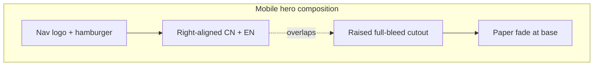

# Mobile Hero Layout Implementation Plan

> **For agentic workers:** REQUIRED SUB-SKILL: Use superpowers:subagent-driven-development (recommended) or superpowers:executing-plans to implement this plan task-by-task. Steps use checkbox (`- [ ]`) syntax for tracking.

**Goal:** Fix the mobile first viewport so the bilingual wordmark is denser and right-aligned, and the character cutout fills mid→bottom as one overlapping poster composition.

**Architecture:** CSS-only wordmark retune inside the existing `@media (max-width: 767px)` block in `Hero.module.css`, plus `HERO_BG.placementMobile` retune in `heroBgConfig.ts`. No content model changes. Desktop artboard (`min-width: 768px`) and cloud-off mobile behavior stay untouched. Raise mobile wordmark `z-index` above the cutout only if type readability fails after the figure is raised.

**Tech Stack:** Next.js 16 App Router, React 19, CSS Modules, `heroBgConfig` placement knobs, optional Playwright screenshots for visual QA.

**Spec:** [docs/superpowers/specs/2026-07-11-mobile-hero-layout-design.md](../specs/2026-07-11-mobile-hero-layout-design.md)

**Breakpoint:** `max-width: 767px` — must stay aligned with `HERO_MOTION_MIN_WIDTH` (768) in `components/hooks/useHeroMotion.ts`.

**Concrete defaults (locked):**

| Knob | Target |
|---|---|
| Wordmark align | `text-align: right`; `left: auto`; `right: 0`; padding `0 22px` (or `24px`) |
| CN size | `clamp(1.75rem, 9vw, 2.5rem)` (~28–40px) — floor must not collapse to 1.25rem |
| EN size | `11px` or `12px`; `letter-spacing: 0.36em` |
| CN↔EN gap | `margin-top: 0.4rem` on `.nameEn` |
| Wordmark top | `top: 16%` (tune 12–18% after visual check) |
| Mobile cutout | `objectFit: 'cover'`, `scale: 1.15`, `positionY: 'center'`, `offsetY: '8%'`, `originY: 'bottom'` — tune after screenshot |
| Mobile clouds | Remain `display: none` / `showClouds === false` |
| Desktop | No edits outside the `max-width: 767px` media block and `placementMobile` |



---

### Task 1: Right-align and densify the mobile wordmark

**Files:**
- Modify: `components/Hero/Hero.module.css` (the `@media (max-width: 767px)` block only)

- [ ] **Step 1: Replace the mobile wordmark / type rules**

Inside `@media (max-width: 767px)`, replace the `.nameZh`, `.nameEn`, and `.wordmark` rules with:

```css
@media (max-width: 767px) {
  .heroComposition {
    inset: 0;
    transform: none;
    width: auto;
    height: auto;
  }

  .wordmark {
    top: 16%;
    left: auto;
    right: 0;
    padding: 0 22px;
    text-align: right;
    z-index: 4; /* above .heroBg (z-index: 3) so type stays readable over the figure */
  }

  .nameBlock {
    display: inline-block;
    max-width: calc(100vw - 44px);
  }

  .nameZh {
    font-size: clamp(1.75rem, 9vw, 2.5rem);
    letter-spacing: 0.06em;
    line-height: 1.15;
    white-space: nowrap;
  }

  .nameEn {
    position: static;
    display: block;
    margin-top: 0.4rem;
    font-size: 11px;
    letter-spacing: 0.36em;
    line-height: 1.45;
    text-align: right;
    white-space: normal;
    max-width: none;
  }

  .cloudWisp,
  .clouds,
  .cloudDiveMist {
    display: none;
  }
}
```

Notes:
- `position: static` on `.nameEn` exits the desktop absolute layout so the EN line participates in normal flow under the CN (tighter, more predictable on wrap).
- If CN overflows at 320px width, change `.nameZh` to `white-space: normal` (do **not** lower the clamp floor below `1.75rem`).
- Do not edit the desktop `.wordmark` / `.nameZh` / `.nameEn` rules above the media query.

- [ ] **Step 2: Visual check wordmark only**

Run (if not already running):

```bash
npm run dev
```

Open `http://localhost:3000` in device mode at **390×844**. Confirm:
- CN is right-aligned under the hamburger side, clearly larger than before
- EN sits tightly under CN, right-aligned
- Title does not collide with the hamburger
- Desktop (≥768) wordmark still centered in the artboard

- [ ] **Step 3: Commit**

```bash
git add components/Hero/Hero.module.css
git commit -m "$(cat <<'EOF'
fix(hero): densify and right-align mobile wordmark

EOF
)"
```

---

### Task 2: Raise and enlarge the mobile character cutout

**Files:**
- Modify: `components/Hero/heroBgConfig.ts` (`placementMobile` only)

- [ ] **Step 1: Retune `placementMobile`**

Replace the current mobile placement:

```ts
placementMobile: {
  scale: 1.75,
  positionY: 'bottom',
  offsetY: '0%',
} satisfies Partial<HeroBgPlacement>,
```

with:

```ts
placementMobile: {
  objectFit: 'cover',
  positionX: 'center',
  positionY: 'center',
  scale: 1.15,
  originX: 'center',
  originY: 'bottom',
  offsetX: '0%',
  offsetY: '8%',
} satisfies Partial<HeroBgPlacement>,
```

Intent: `cover` + center Y fills the mid→bottom dead cream band; bottom origin keeps scale growth upward into the title zone; small positive `offsetY` nudges the figure down slightly if heads clip the top bar — **invert to a negative %** (e.g. `-4%`) if the figure still sits too low after the first screenshot.

`getHeroBgImageStyle(!showClouds)` already passes `mobile=true` when clouds are off (`Hero.tsx`), so no TSX change is required for the config to apply.

- [ ] **Step 2: Visual tune against acceptance criteria**

At **390×844**, check:
1. Cream mid-gap is gone
2. Character heads sit near/above vertical mid
3. Title overlaps the figure’s mid/shoulder area
4. Soft paper fade at the base still works
5. Robes are not clipped awkwardly at the bottom edge

If the figure is still too low, try in order:
1. `offsetY: '-6%'` or `'-10%'`
2. `scale: 1.25` or `1.35`
3. `positionY: '35%'` (heads higher)

If the figure crops faces too aggressively, drop back to `objectFit: 'contain'` with `scale: 2.1` and `positionY: 'bottom'` + `offsetY: '-18%'` (grow upward from the base).

At **320×568**, confirm CN remains ≥ ~28px and does not collide with the logo/hamburger.

At **1280×800**, confirm desktop cutout / wordmark are unchanged (desktop uses `placement`, not `placementMobile`).

- [ ] **Step 3: Optional Playwright baseline screenshot**

If the local QA Playwright pattern is available, capture mobile hero for before/after under `.qa-screenshots/`. Otherwise rely on device-mode screenshots. No automated assertion suite exists in this repo.

- [ ] **Step 4: Commit**

```bash
git add components/Hero/heroBgConfig.ts
git commit -m "$(cat <<'EOF'
fix(hero): raise mobile character cutout into mid viewport

EOF
)"
```

---

### Task 3: Final verification

**Files:**
- None expected (read-only checks). Touch `Hero.module.css` / `heroBgConfig.ts` only if Task 2 tuning left a residual gap.

- [ ] **Step 1: Lint**

```bash
npm run lint
```

Expected: no new errors in Hero files.

- [ ] **Step 2: Acceptance checklist**

Walk the spec acceptance criteria on mobile 390×844 and 320×568, plus desktop spot-check:

1. Cream mid-gap gone — one continuous hero plane
2. CN larger + right-aligned
3. EN tight under CN, ≥11px, right-aligned
4. Heads near/above vertical mid
5. Title overlaps figure; no hamburger collision
6. Base paper fade intact
7. Desktop ≥768 unchanged
8. Mobile clouds still off; reduced-motion path unchanged

- [ ] **Step 3: Commit any final tuning** (skip if clean)

```bash
git add components/Hero/Hero.module.css components/Hero/heroBgConfig.ts
git commit -m "$(cat <<'EOF'
fix(hero): final mobile composition tune

EOF
)"
```

---

## Self-review (plan vs spec)

| Spec requirement | Task |
|---|---|
| Horizontal denser wordmark | Task 1 |
| Right-aligned under top bar | Task 1 |
| No poem / no new content | (non-goal — no task) |
| Full-bleed mid→bottom figure with overlap | Task 2 |
| Mobile clouds stay off | Task 1 keeps `display: none` |
| Desktop untouched | Tasks only edit mobile media + `placementMobile` |
| Wordmark z-index above cutout if needed | Task 1 sets `z-index: 4` on mobile |
| Acceptance / verification | Task 3 |
